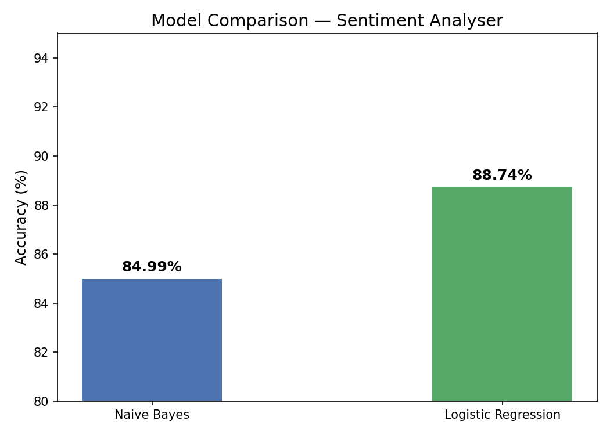
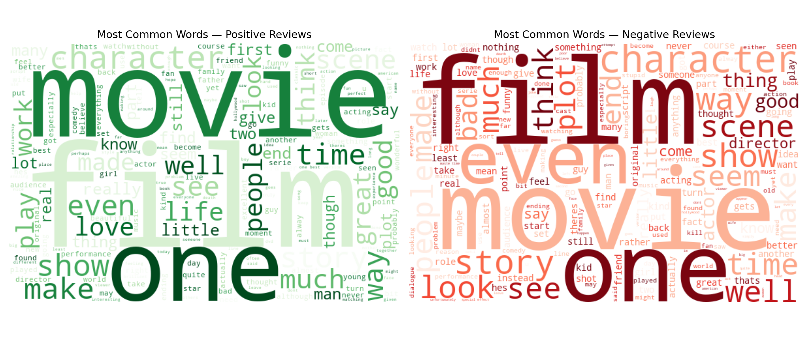
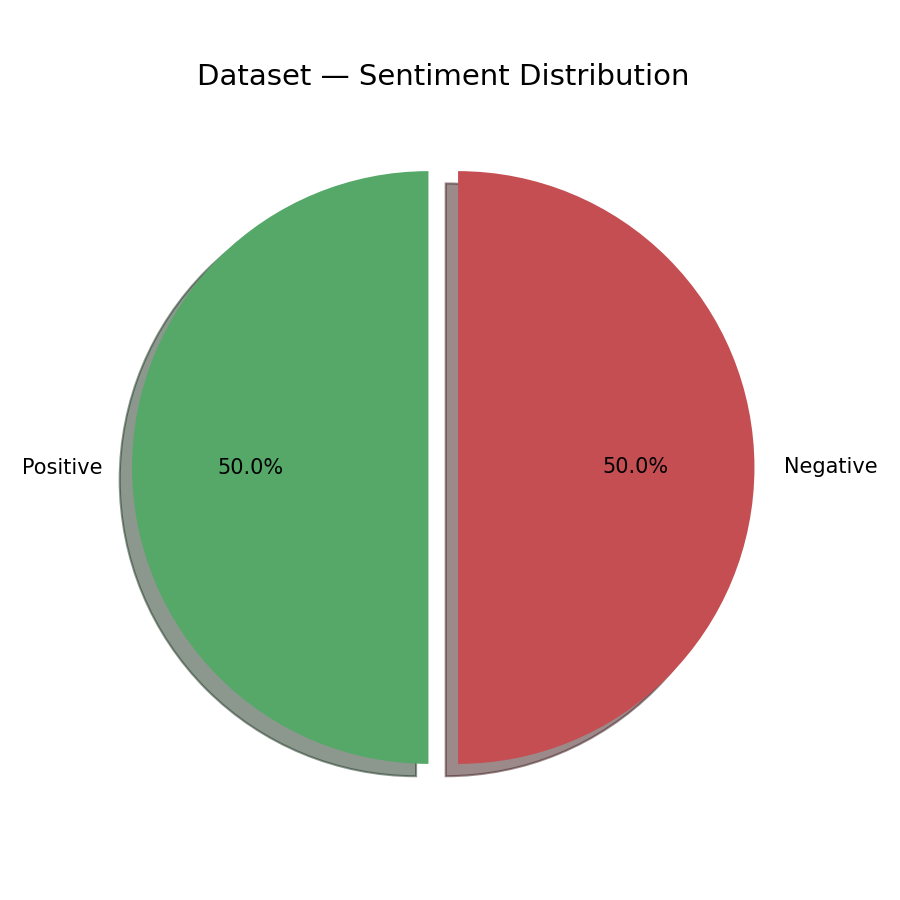

# 🎬 Sentiment Analyser

A machine learning project that classifies movie reviews as **Positive** or **Negative** using NLP techniques.

Built as part of preparation for **Amazon ML Summer School 2026**.

---

## 📊 Results

| Model | Accuracy |
|---|---|
| Naïve Bayes | 84.99% |
| Logistic Regression | **88.74%** ✅ |

---

## 🛠️ Tech Stack

- **Python 3**
- **scikit-learn** — Naïve Bayes, Logistic Regression, TF-IDF
- **NLTK** — Stopword removal, text preprocessing
- **Matplotlib & Seaborn** — Visualisations
- **WordCloud** — Word frequency visualisation
- **Flask** — Interactive web app

---

## 📁 Project Structure

sentiment-analyser/
│
├── data/                  ← Dataset and saved models
├── src/
│   ├── check.py           ← Dataset verification
│   ├── preprocess.py      ← Text cleaning + TF-IDF
│   ├── train.py           ← Model training + evaluation
│   ├── visualise.py       ← Charts and word clouds
│   └── app.py             ← Flask web app
├── outputs/               ← Saved visualisation images
└── README.md
---

## 🔄 Pipeline

---

## 🔄 Pipeline

Raw Text → Clean Text → TF-IDF → ML Model → Positive/Negative

1. **Preprocessing** — Remove HTML, lowercase, remove stopwords
2. **TF-IDF Vectorisation** — Convert text to numbers (top 5000 features)
3. **Model Training** — Naïve Bayes + Logistic Regression
4. **Evaluation** — Accuracy, confusion matrix, classification report

---

## 📈 Visualisations

### Model Comparison


### Word Clouds


### Sentiment Distribution


---

## 🚀 How to Run

```bash
# Clone the repo
git clone https://github.com/YOUR_USERNAME/sentiment-analyser.git
cd sentiment-analyser

# Install dependencies
pip install pandas numpy scikit-learn matplotlib seaborn nltk wordcloud flask

# Download IMDB dataset from Kaggle and place in data/

# Run preprocessing
python src/preprocess.py

# Train models
python src/train.py

# Visualise results
python src/visualise.py

# Run web app
python src/app.py
```

---

## 📚 Dataset

[IMDB Dataset of 50K Movie Reviews](https://www.kaggle.com/datasets/lakshmi25npathi/imdb-dataset-of-50k-movie-reviews) — Kaggle

---

## 👨‍💻 Author

**Lakshitha G.H**
3rd Year B.E. CSE (AI & ML) — RNSIT, Bengaluru